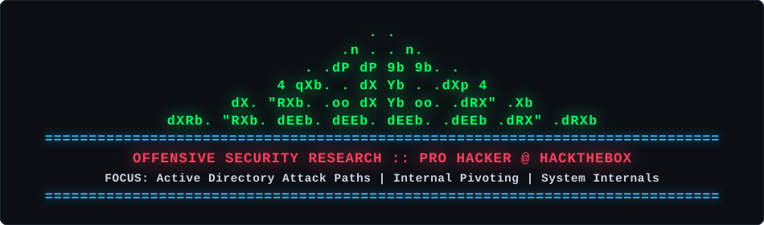

<div align="center">



</div>

```text
 ┌──[ 0x01 :: ACTIVE DIRECTORY EXPLOITATION ]
 │
 ├── Identity Attacks ──► Kerberoasting · AS-REP · Pass-the-Hash/Ticket · DCSync
 ├── Graph & Enum     ──► BloodHound / SharpHound · PowerView · NetExec
 └── Toolchain        ──► Mimikatz · Rubeus · Impacket Suite
 │
 ├──[ 0x02 :: LOW-LEVEL & ENVIRONMENTS ]
 │
 ├── Languages        ──► Python · C / C++ · Bash · PowerShell
 ├── Target OS        ──► Linux (Kernel/PrivEsc) · Windows Server (AD DS / CS)
 └── Traffic Analysis ──► Wireshark · Packet Crafting · Raw Sockets
 │
 └──[ 0x03 :: OFFENSIVE TOOLING & AUDIT ]
   
   ├── Web / Perimeter ─► Burp Suite Pro · OWASP ZAP · Evilginx
   ├── Recon / Scan    ─► Nmap (Custom NSE) · Metasploit Framework
   └── Cracking / Auth ─► Hashcat (Rulesets & Masks) · John the Ripper
```

<pre>
[+] HTB Profile : <a href="https://profile.hackthebox.com/profile/019cec25-2029-70a5-ad08-c4d807b5d9d1">profile.hackthebox.com/JJTHOMPSON0</a>
[+] Status      : Compromising targets & building offensive tooling.
</pre>
